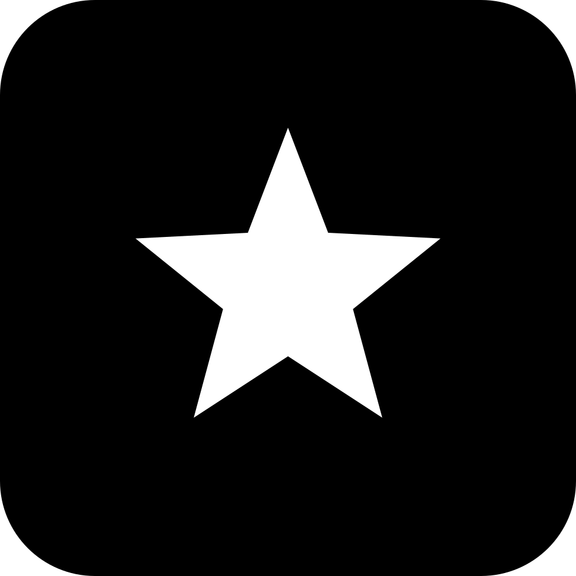

<div align="center">
  
  <h1>gray-achieve</h1>
  <p><strong>Unlockable achievements, awarded live from the tool and turn event stream.</strong></p>
  <p>
    <a href="https://gray.alignment.id">Website</a> ·
    <a href="https://gray.alignment.id/plugins/gray-achieve">Store</a> ·
    <a href="https://github.com/vstaln/gray-achieve">Source</a> ·
    <a href="https://github.com/vstaln/gray">gray</a>
  </p>
  <p>
    <a href="LICENSE"></a>
    <a href="https://www.rust-lang.org"></a>
    <a href="https://gray.alignment.id/plugins/gray-achieve"></a>
  </p>
</div>

<br/>

```bash
gray plugin install gray-achieve
```

Achievement badges unlocked from the live event stream — the sidecar
watches `pre_tool`, `post_tool` and `turn_end` notifications in real time
and awards each badge the moment its condition fires.

A sidecar plugin for [gray](https://github.com/vstaln/gray), scaffolded by
[gray-account](https://github.com/vstaln/gray-account).

## Badges

| id | name | unlock |
|----|------|--------|
| `first_tool` | First Contact | any tool call |
| `tool_10` | Toolchain Ten | 10 tool calls (persistent counter) |
| `tool_100` | Centurion | 100 tool calls |
| `first_bash` | Shell Shocked | a `bash` call |
| `first_write` | Pen to Paper | a `write` / `edit` / `notebook_edit` call |
| `first_error_seen` | Red Text | a failed tool call |
| `night_owl` | Night Owl | `turn_end` between 00:00–06:00 local |
| `marathon` | Marathon | a single turn over 100k tokens |

Unlocks append `{id, name, ts}` to `~/.gray/achievements.json` and fire
`host/say "🏆 <name>"`. The `host.say` capability needs consent — without it
the say fails silently and the unlock still lands on disk:

```sh
gray plugin capabilities achieve --all
```

The tool-call counter persists in `~/.gray/achieve/state.json`.

## Usage

```text
/achievements    # unlocked (with UTC timestamps) and locked badges
```

## Install

```sh
gray plugin install achieve
```

## Wire methods

- `plugin/manifest` — declares `/achievements` + `host.say` capability
- `event/notify` — `pre_tool` / `post_tool` / `turn_end` notifications
- `command/run` — `/achievements` listing
- `host/say` — unlock announcements (capability `host.say`, degrades silently)
- `plugin/shutdown`

## Develop

```sh
cargo test
gray account check      # entry point + manifest handshake
gray account publish    # check → build → release → publish to the gray registry
```

Bump `version` in `Cargo.toml` before each `publish`; the registry refuses to
republish a version.

## Tags

`gray` `plugin` `achieve` `rust`

---
Part of the [gray](https://github.com/vstaln/gray) plugin ecosystem —
the open-source AI agent harness. <https://gray.alignment.id>
